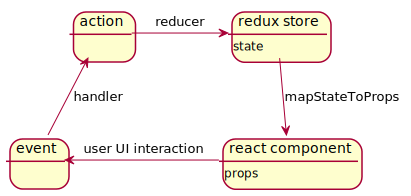
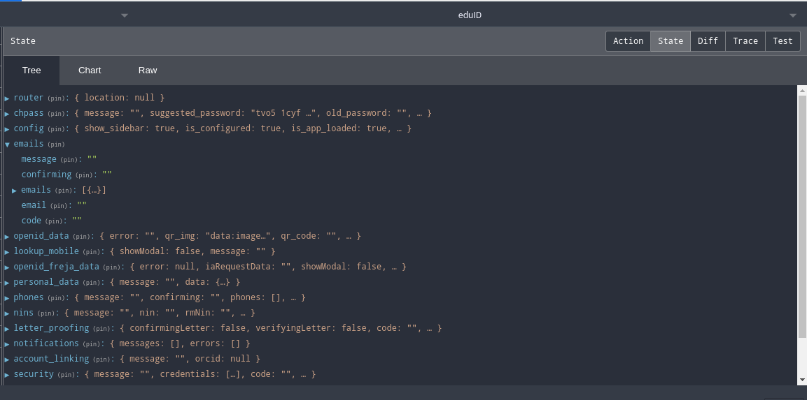

# Basic architecture for eduid-front

Main libraries used:

* [React][1] - provides components abstracted from the DOM
* [Redux][2] - keeps a centralized state
* [Sagas][3] - provides asynchronous actions

Also on top of redux we use [redux-form][4] for forms.

Abstractly, the architecture of eduid-front is based upon the idea ([Flux][5] / Redux)
of a central store with all the state of the app.
Here, "state" means all the data that the JS app needs to work,
and that can change from user to user or from moment to moment.
This data can come from the server, or as the result of user interactions.

As we will see below, this data is put into the app (into the state) via actions,
that are dispatched to the store and change the state in predetermined ways.

In addition, when the state changes, it notifies the React components,
and then each component decides whether to re-render or not, based on the new state.

<!--

@startuml img/basic_arch

state "redux store" as store
store: state
state "react component" as comp
comp: props
state event
state action

store -down-> comp: mapStateToProps
comp -left-> event: user UI interaction
event -up-> action: handler
action -right-> store: reducer

@enduml

-->



The rest of this document is an attempt to clarify all the concepts
needed to understand this architecture.

## eduID components

In general, an eduID component is developed in several modules:

* Visual aspects
  * Component (React): Module within `components/`, containing the render function with all the markup.
  * Style ([Sass][6]): Module within `styles/`, with style rules.
* functional aspects
  * Container (Redux): Module within `containers/`, Here we define 2 functions described in detail below, `mapStateToProps` and `mapDispatchToProps`,
    that connect Reacct components with the redux store.
  * Actions (Redux): Module within `actions/`, contains the actions that can be dispatched from the handlers and sagas of the component (or of any other component if it is reused).
  * Reducer (Redux): Module within `reducers/`. If the component has a reducer, it keeps a piece o state as a property of the central state, provided by the reducer.
  * Sagas (Sagas): Contains async procedures.

Not all components need all files;
there may be structural components with only its "component" file,
or components with behaviour that do not need async actions and thus have no "sagas" file.

Originally I did not expect to end up with so many components,
so I opted for a flat arrangement of files: all components in a `components/` directory, etc.

### Componentization strategy

Componentization in terms of visual elements does not necessarily correspond
with componentization in terms of functional elements,
so a compromise needs to be found.
The 2 following paragraphs try to provide an impression of the kind of compromise needed.

Originally, I componentized in terms of functional elements:
All the actions, reducers, and sagas that work together would correspond to a component,
independently of the amount of markup needed.
So some components had a lot of markup.

Nathalie is doing a great job of breaking these components up in smaller components,
but care must be taken that the functional elements don't get too dispersed, e.g.:
A handler defined in a subcomponent, that changes props of a supercomponent
through an action defined in yet another component - it may end up difficult to follow.

Note: React components have, in addition to their props, a state
that can be changed internally (in opposition to the props, that can only be changed externally).
Since the objective is to keep all app state in the central store,
and change components externally from the central state,
there is very little use in eduID of the local state of reacts components.
There is a [discussion on this topic here][7].

## Basic redux (actions, central store, and reducers)

The basic responsibility of Redux is to keep state in a central store.
Changes in the central state are enacted via actions,
which are plain JS objects with a conventional structure.
These actions are provided to a `dispatch` function,
that takes them to the central state through the reducers.

### the central state.

The state kept in redux's central store is a plain JS object,
with a totally arbitrary structure, only determined by the needs of the app
(i.e., by the developer).
As we will see below, each reducer will be responsible
for the data in a particular property (or key) of the state.
Reducers receive actions and change their piece of central state accordingly.

This object state must be treated as immutable:
when reducers change the state, they should change and return a copy of the previous state.

To inspect the central state in a running app, it is advisable to install the [redux dev tools in the browser][8].
Further below there is a screenshot of the state in eduID in chromium's redux dev tools.

NOTE: In general, in eduID, the state corresponding to each component
(kept under the corresponding key in the central state)
keeps data related to the success / failure expressed in the last action that has affected it.
This is not used, and might welcome a cleanup.

### actions

As said, an action is just a plain old JS object (sometimes called POJO)
with essentially a `type` key with a string value (usually capitalized)
and a `payload` key with an object value.

What we have in the actions files are very simple functions
that return an action object, possibly parameterized.

An example:

```javascript
export const CONFIG_SUCCESS = "CONFIG_SUCCESS";


export function getConfigSuccess(config) {
  return {
    type: CONFIG_SUCCESS,
    payload: {
      config: config
    }
  };
}
```

This action might be dispatched e.g. when the app successfully tries to retrieve data from the server.

The structure of these actions is specified in the [flux standard][9].

Note: In eduID, the data that is returned from the microservices is in this format,
so it can be directly given to `dispatch`. 
The data that the front sends to the microservices does not have any particular structure,
it's arbitrary JSON (conforming to each microservice's expectations).

### reducers

Each reducer module contains an object with an initial state, and a reducer function.

All initial states are combined into the store at startup to create the initial central state,
each reducer under its own key, [by the `combineReducers` function][10].

As an example, the Emails component keeps [this initial state][11]
and [is registered here][12], so the central state
(below we can see a screenshot of the central state as redux dev tools shows it)
has an `emails` key with the structure specified in the reducer.



Then, each time an action is dispatched,
the action is given to all the reducers,
each of which returns a copy of its corresponding sub-state,
possibly changed,
and all the returned sub-states are again combined into the central state.

So for each dispatched action, the central state is recreated.

The reducer functions are basically a switch statement,
matching on action.type and returning a new object with the new state.
Here we can see [the reducer for the Emails component][13].
There we can see how when the reducer receives a `GET_EMAILS_SUCCESS` action
it will put `action.payload` in the state,
and the payload will carry an `emails` key with the emails.

All dispatched actions go through all registered reducers,
each of which is in charge of a piece (a particular property) of the store.

Note: sub-states of the central state often have more properties than the corresponding initial sub-state:
reducers are not limited by whatever initial state they use.
In particular, each main component has a reducer that keeps state under the `config` property of the central state,
and will contain all the configuration sent from the backend.

## Redux + React in eduID

To integrate with React, Redux provides a function `connect` that
takes a React component and returns a HOC "connected" in 2 ways to the central store:

* When the central state changes, the changes are relayed to the connected components,
  through the `mapStateToProps` functions (also provided to `connect`).
* Connected components can use `dispatch` in its methods defined within `mapDispatchToProps` (also provided to `connect`),
  to pass data into the central store.

### mapStateToProps

`mapStateToProps` is a function that allows the developer to map, for each component,
pieces of the central state to the props of the component.
This function will be called by redux whenever there is a change of the central state,
and, if any of the pieces of state that this function uses has changed,
its props will change, triggering a rerendering.

As an example, [the function in the container of the Emails component][14],
where we can see how the Emails component has an `emails` prop, that is taken from the state `state.emails.emails`.

### mapDispatchToProps

`mapDispatchToProps` is a function that allows the developer to add functions to the props of a component,
with the particularity that she can use the `dispatch` function within those functions.
This allows the developer to develop handlers for events that can `dispatch` actions to the central store.

As an example, [mapDispatchToProps for the Emails component][15].
There we can see for example the definition of `handleAdd`, where we dispatch a `postEmail` action.
`handleAdd` is then [used as a handler for a user event][16].

## Sagas

Sagas allow the developer to have asynchronous reactions to actions.

For example, a user interaction may need to fetch data from the server.
The user interaction will dispatch an action,
and when the app sees this action, it will send a request to the server.
But we do not want to block the app waiting for a response.
So we use a saga.

Sagas [are hooked to action types][17],
so that whenever an action is dispatched (and before it reaches the reducers)
all the sagas hooked to the type of the action are executed.

The actual sagas are [generator functions][18],
that can give control back to the caller while waiting for things,
thus providing asynchronicity.

Within a saga, it is possible to both access the central state (using the `select` function)
and dispatch actions (using the `put` function). In eduID, we mostly use sagas to send and retrieve
stuff from the microservices. So the common structure of a saga is:

* Get any needed data (including URLs) from the state.
* Send request to some microservice.
* extract CSRF token from response, dispatch as action (through `putCsrfToken`)
* dispatch the rest of the data in the response (minus the csrf token) as an action.

A very straight forward example of an action that does just that [is this one][19],
that signals the backend to resend a verification code for a given email.


[1]: https://reactjs.org/
[2]: https://redux.js.org/
[3]: https://redux-saga.js.org/
[4]: https://redux-form.com/
[5]: https://facebook.github.io/flux/
[6]: https://sass-lang.com/
[7]: https://redux.js.org/faq/organizing-state/
[8]: https://github.com/reduxjs/redux-devtools
[9]: https://github.com/redux-utilities/flux-standard-action
[10]: https://github.com/SUNET/eduid-front/blob/master/src/dashboard-store.js#L21
[11]: https://github.com/SUNET/eduid-front/blob/master/src/reducers/Emails.js#L3
[12]: https://github.com/SUNET/eduid-front/blob/master/src/dashboard-store.js#L25
[13]: https://github.com/SUNET/eduid-front/blob/master/src/reducers/Emails.js#L11
[14]: https://github.com/SUNET/eduid-front/blob/master/src/containers/Emails.js#L19
[15]: https://github.com/SUNET/eduid-front/blob/master/src/containers/Emails.js#L29
[16]: https://github.com/SUNET/eduid-front/blob/master/src/components/Emails.js#L45
[17]: https://github.com/SUNET/eduid-front/blob/master/src/dashboard-root-saga.js#L60
[18]: https://developer.mozilla.org/en-US/docs/Web/JavaScript/Guide/Iterators_and_Generators
[19]: https://github.com/SUNET/eduid-front/blob/master/src/sagas/Emails.js#L37
